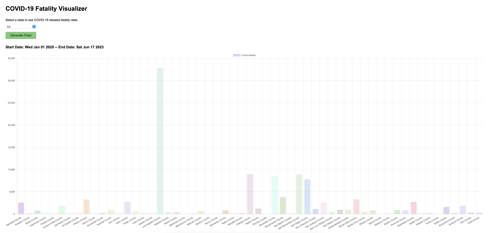

# [covid-insider](<(https://covid-insider.vercel.app)>)

Visualize **COVID-19** infection rates by state

**See it live [here](https://covid-insider.vercel.app)**

**This project is developed in VanillaJS, HTML, and CSS on purpose. It was my first project in college but I also wanted to test ChartJS performance in a raw, non SPA environment**
